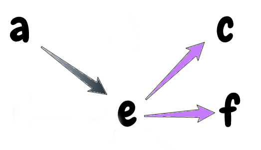
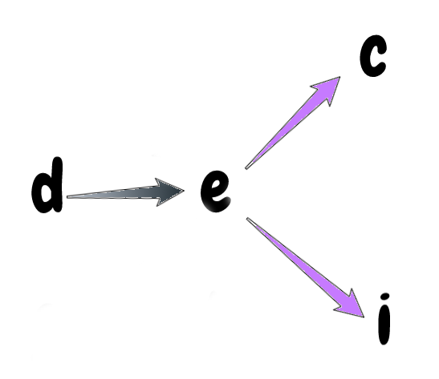
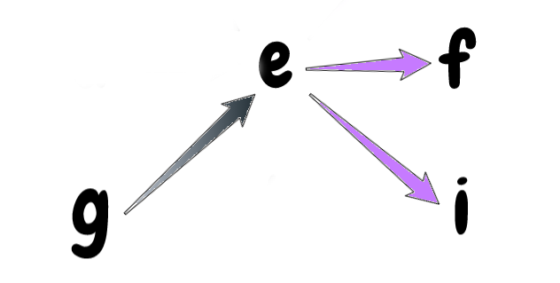
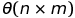

# Solutions

In order to collect as much gold as possible from the mine, it is required to
check all possible paths starting from the first column to the end column.

However, at each position, there are 3 possible ways to move, and 2 out of
those 3 ways are valid as they are different from the previous moves. Except
that each position in the first column has 3 valid ways to move, since there
is no previous move.

Therefore, using brutefoce to find all possible ways will lead to exponential
time complexity. Thanks to the dynamic programming the time complexity can
reduce to polynomial.


Now, let's consider the position `e`, there are 3 ways to get to position `e` (from `a`, `d` and `g`), and there are 3 ways to go from the position `e` (go to `c`, `f`, and `i`).

Let's see the valid ways to go from `e` when coming from each of `a`, `d`, and `g`







According to the pictures, to find the best mining result when coming to position `e`, it is needed to check both the mine result of both of the valid ways. Therefore, according to position e, it needs to track the result of each incoming direction (from `a`, `d`, and `g`), and each of the direction trackings will need to store the result of each outgoing direction (go to `c`, `f` and `i`), so we can use the result when coming from other directions. Otherwise, there will be duplicate in computing the result of outgoing directions.

For instance, both the result at `e` when coming from `a` and `d` need the result of going from `e` to `c`. This duplication will lead to exponential time complexity. The invalid outgoing can be **undefined** or any **`Number`**, since we do not need to take care of that case.

As the above analysis, the tracking for dynamic programming algorithm at position `e` will have the form:

```Javascript
const possibleMoves = [
  -1, // Go diagonally right and up
   0, // Go right
   1  // Go diagonally right and down
]

let tracking_at_e = [
  // First direction: the previous move is diagonally right and up
  {
    // the best mine result when the previous move is diagonally right and up
    bestMine: Number,
    // The best way to move when the previous move is diagonally right and up.
    // This will be a index of `possibleMoves` that results the best gold collection.
    bestMove: Number,
    // Tracking of outgoing move,
    moves: [
      // Cannot go diagonally right and up, as it is the previous move
      undefined,
      // The best gold collected when go right
      Number,
      // The best gold collected when go diagonally right and down
      Number

    ]
  },


  // Second direction: the previous move is going right
  {
    // the best mine result when the previous move is going right
    bestMine: Number,
    // The best way to move when the previous move is going right.
    // This will be a index of `possibleMoves` that results the best gold collection.
    bestMove: Number,
    // Tracking of outgoing move,
    moves: [
       // The best gold collected when go diagonally right and up
      Number,
      // Cannot go right, as it is the previous move
      undefined,
      // The best gold collected when go diagonally right and down
      Number
    ]
  },

    // Third direction: the previous move is diagonally right and down
  {
    // the best mine result when the previous move is diagonally right and down
    bestMine: Number,
    // The best way to move when the previous move is diagonally right and down.
    // This will be a index of `possibleMoves` that results the best gold collection.
    bestMove: Number,
    // Tracking of outgoing move,
    moves: [
       // The best gold collected when go diagonally right and up
      Number,
       // The best gold collected when go right
      Number,
      // Cannot go diagonally right and down, as it is the previous move
      undefined,
    ]
  }
]
```

If `e` is in the first column, which means there is no previous move, the `moves` array in each of the tracking objects will have no **undefined** value, as all of the three directions are valid.

Furthermore, to find the starting row, it is needed to check all the positions in the first columns to find the row that results in the highest amount of gold.

After performing the dynamic programming, it can find the way to achieve the highest gold collection by starting at the best row found above, and follow the path that is in the tracking (`bestMove`).

**Time complexity:**


